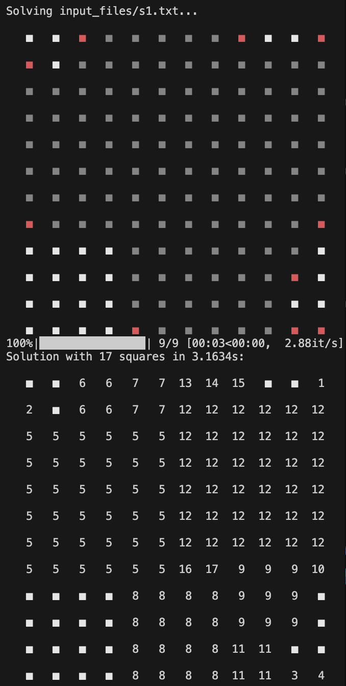

# cimpress
## 🚀 Launch solver:
```bash
python src/main.py
```

## ⚙️ Implemented solutions
Each recursion goes deeper inside tables possibilities. The goal is to reduce the number of checked possibilities to be runable in a quick enought time.
For each recursion we do:
- We fill every corner that can't expand (isolated ones) to remove 1 recursion for each one.
- We create a recursion for each corner in the new table to avoir creating a recursion for each free space as bigger square allways touch at least one corner.
- To find the bigger one, we created a square on the corner that expands until he can't.
- We have created a memory of seen table composition. Before launching the recursion on the new table after adding a square in corner we check if the created table has already been seen and if it does, we don't launch the next recursion to avoid useless redundant checks. Speeds up a lot.
- We added a max_authorized_index, that allways fit to the maximum of solution during algorithme, to stop recursion calls if it get higher index of squares as solution will not be better and be useless calls.

## 🔍 Results
### Solution for: s1.txt


